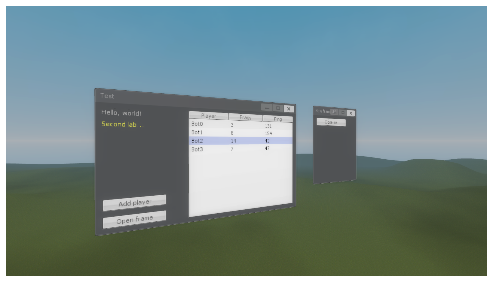

## Synopsis

A simple library to draw VGUI panels in 3D space, created by [Alexander Overvoorde](https://while.io) and [Matt Stevens](http://handsomematt.co.uk).



## Usage

You can find examples in the `samples` folder but the basic usage is as follows:

```
local sampleFrame = vgui.Create( "DFrame" )
sampleFrame:SetPos( 0, 0 )
sampleFrame:SetSize( 200, 250 )
sampleFrame:ParentToHUD()

hook.Add( "PostDrawOpaqueRenderables", "DrawDemoFrame", function()
	vgui.Start3D2D( Vector(), Angle(), 1 )
		sampleFrame:Paint3D2D()
	vgui.End3D2D()
end )
```

## Bugs and feature requests

Have a bug or a feature request? [Please open a new issue](https://github.com/GModCoders/3d2d-vgui/issues).

## License

Copyright 2015-2017 Alexander Overvoorde and Matt Stevens under [the MIT license](LICENSE).
